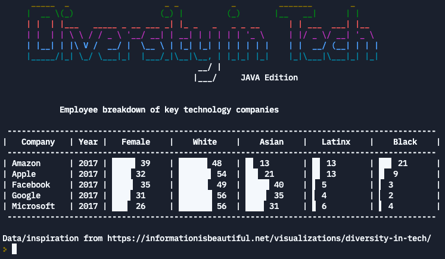

 

# Lab 13 - Diversity In Tech + Repetition/Looping

**Create a visual representation of the data from [Diversity in Tech website](https://informationisbeautiful.net/visualizations/diversity-in-tech/) using a Bar Graph Generator Program**

_Learning Objective: demonstrate an understanding of looping/ repetition by completing code to populate a bar graph and display with ASCII art to the console._

# **Lab Prompt:**

In recreating the website above, a student took the **_top-down approach_** of building out the big picture of the program and stubbing out the methods that are doing the detailed work. They were able to complete the driver, the `main` method that runs the program, and organized everything related to creating the graphs under there `BarGraph` file/class.

The final version should look like:

 

# **Lab Instructions:**

Complete the `getHorizontal` method so that it creates a horizontal bar graph, using the constants in `BarGraph` file/class. The method is called multiple times in the `main` method, which should look when complete like the screenshot above.

In the code, you'll notice that there are 8 block characters, meaning we're working with factors of 8. This is because those characters are precisely blocks that have varying widths, 8 total.

# **Hacker Challenge (note this will break the tests above):**

- Add colors to the bar graphs! Before proceeding, think of a couple of locations that it could be placed in (I can think of at least 2!) and what are the advantages/disadvantages of each. Which is the most flexible, to change the colors for each bar in the screenshot above? Which is the easiest for you to add in?
- Create a new `getHorizontal` method that has an additional parameter, a boolean, that controls whether the integer value shows up next to the bar graph or not (you will need to change the method calls in your main method to call this specific method to test it!)
- Create another `getHorizontal` method that has one more parameter, a String, for the color to use with the bar graph built (you will need to change the method calls in your main method to call this specific method to test it!) [Note: the table may break here, you may need to change the widths in the formatted output to get everything aligned again]

**_Not sure what each graph should look like?_** Here's what every single bar graph between 0 and 100 should look like, we definitely don't want to branch to print every single one of these options! Your method should be able to go beyond 100, but the tests and use in this program is only for 0-100. We'll use it for the future to go beyond 100, but for now, here are what they look like:

0

▏ 1

▎ 2

▍ 3

▌ 4

▋ 5

▊ 6

▉ 7

█ 8

█▏ 9

█▎ 10

█▍ 11

█▌ 12

█▋ 13

█▊ 14

█▉ 15

██ 16

██▏ 17

██▎ 18

██▍ 19

██▌ 20

██▋ 21

██▊ 22

██▉ 23

███ 24

███▏ 25

███▎ 26

███▍ 27

███▌ 28

███▋ 29

███▊ 30

███▉ 31

████ 32

████▏ 33

████▎ 34

████▍ 35

████▌ 36

████▋ 37

████▊ 38

████▉ 39

█████ 40

█████▏ 41

█████▎ 42

█████▍ 43

█████▌ 44

█████▋ 45

█████▊ 46

█████▉ 47

██████ 48

██████▏ 49

██████▎ 50

██████▍ 51

██████▌ 52

██████▋ 53

██████▊ 54

██████▉ 55

███████ 56

███████▏ 57

███████▎ 58

███████▍ 59

███████▌ 60

███████▋ 61

███████▊ 62

███████▉ 63

████████ 64

████████▏ 65

████████▎ 66

████████▍ 67

████████▌ 68

████████▋ 69

████████▊ 70

████████▉ 71

█████████ 72

█████████▏ 73

█████████▎ 74

█████████▍ 75

█████████▌ 76

█████████▋ 77

█████████▊ 78

█████████▉ 79

██████████ 80

██████████▏ 81

██████████▎ 82

██████████▍ 83

██████████▌ 84

██████████▋ 85

██████████▊ 86

██████████▉ 87

███████████ 88

███████████▏ 89

███████████▎ 90

███████████▍ 91

███████████▌ 92

███████████▋ 93

███████████▊ 94

███████████▉ 95

████████████ 96

████████████▏ 97

████████████▎ 98

████████████▍ 99

████████████▌ 100